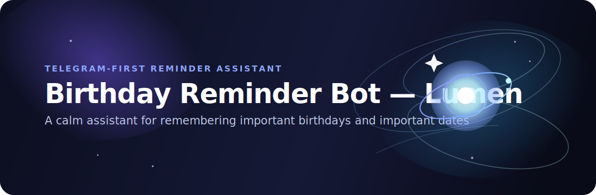

# 🎂 Birthday Reminder Bot — Lumen

> A calm Telegram-first assistant for remembering important birthdays and important dates.

Birthday Reminder Bot — Lumen helps you keep important birthdays in one place and reminds you about them at the right time.

## What it does

- helps you save birthdays in a simple Telegram flow
- shows upcoming birthdays in one main screen
- lets you quickly open and edit each birthday card
- sends reminders on the birthday itself
- supports per-user notification time and timezone settings

## Main flows

### Add a birthday
Use `/add` or open `/menu` and follow the step-by-step flow. Each step includes a back button so you can return and edit previous answers before saving.

### Check upcoming birthdays
Use `/upcoming` to see the nearest important dates and open any birthday card from there.

### Find a person quickly
Use `/search <name>` to find a birthday card by name.

### Manage reminder settings
Open `/menu` → `⚙️ Настройки` to update your timezone, notification time, or reminder preferences.

## Main commands

- `/start`
- `/menu`
- `/add`
- `/upcoming`
- `/search <name>`
- `/view <name>`
- `/note <name> | <text>`
- `/toggle <name>`
- `/rename <name> | <new name>`
- `/setdate <name> | <DD.MM or DD.MM.YYYY>`
- `/delete <name>`
- `/cancel`

## Product notes

- `/menu` is the main entry point for everyday use
- `/upcoming` is the primary list screen
- birthday cards support quick actions like edit, delete, and reminder toggle
- reminders include inline actions to open the card or disable reminders directly
- settings support timezone presets, manual timezone entry, quick time presets, and notification toggle

## Development

See `.env.example` for environment variables.

Available scripts:
- `npm run dev`
- `npm run build`
- `npm run start`
- `npm run scheduler`
- `npm run typecheck`
- `npm run lint`
- `npm run test`
- `npm run prisma:generate`
- `npm run prisma:migrate:dev`
- `npm run prisma:migrate:deploy`
